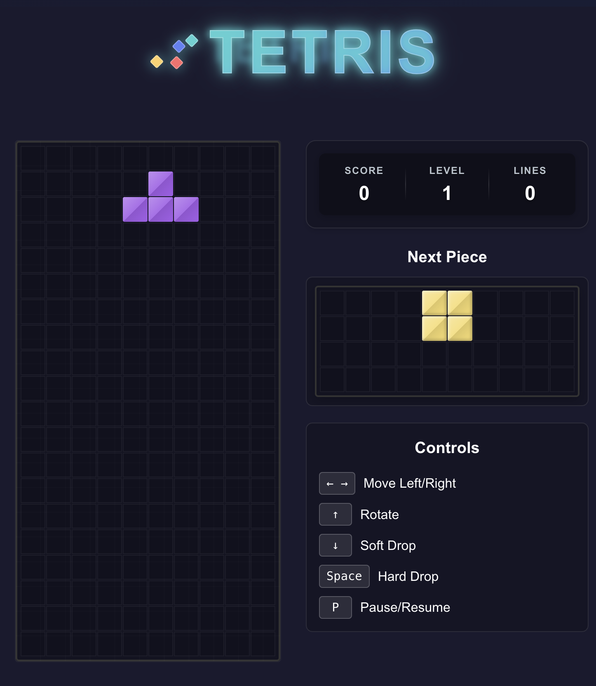

# Multiplayer Tetris on Monad

A modern implementation of the classic Tetris game with multiplayer capabilities, built with React, Multisynq, and powered by Monad blockchain technology. This project features real-time multiplayer gameplay, blockchain integration, and all the classic Tetris mechanics you know and love.



## 🎮 Features

- 🕹️ Classic Tetris gameplay with multiplayer support
- 🌐 Real-time synchronization using Multisynq technology
- ⛓️ Powered by Monad blockchain for secure and transparent gameplay
- 🖥️ Responsive design that works on all screen sizes
- ⚡ Built with React 18 and TypeScript
- 🎨 Modern UI with smooth animations
- ⌨️ Keyboard controls for the best gaming experience
- 📊 Score tracking and level progression with on-chain verification
- ⏯️ Pause/resume functionality
- 🔄 Next piece preview

## 🚀 Getting Started

### Prerequisites

- Node.js (v16 or later)
- npm or pnpm (recommended)

### Installation

1. Clone the repository:
   ```bash
   git clone https://github.com/lispking/tetris.git
   cd tetris
   ```

2. Install dependencies:
   ```bash
   pnpm install
   # or
   npm install
   ```

3. Start the development server:
   ```bash
   pnpm dev
   # or
   npm run dev
   ```

4. Open [http://localhost:5173](http://localhost:5173) in your browser to play!

## 🎮 Controls

- **Arrow Left/Right**: Move piece horizontally
- **Arrow Down**: Soft drop (move down faster)
- **Arrow Up**: Rotate piece clockwise
- **Space**: Hard drop (instantly drop piece)
- **P**: Pause/Resume game

## 🛠️ Built With

- [React](https://reactjs.org/) - JavaScript library for building user interfaces
- [TypeScript](https://www.typescriptlang.org/) - Typed JavaScript
- [Vite](https://vitejs.dev/) - Next Generation Frontend Tooling
- [CSS Modules](https://github.com/css-modules/css-modules) - For scoped CSS
- [Monad](https://monad.xyz/) - High-performance EVM-compatible blockchain
- [Multisynq](https://multisynq.io/) - Real-time state synchronization framework

## 📝 License

This project is licensed under the Apache License 2.0 - see the [LICENSE](LICENSE) file for details.

## 🌟 Powered by Monad & Multisynq

This project leverages the power of:

- **Monad Blockchain**: A high-performance, parallel EVM-compatible blockchain that enables fast and secure on-chain game state management.
- **Multisynq**: A real-time state synchronization framework that enables seamless multiplayer experiences with minimal latency.

## 🙏 Acknowledgments

- Inspired by the classic Tetris game
- Built with ❤️ using modern web technologies and blockchain
